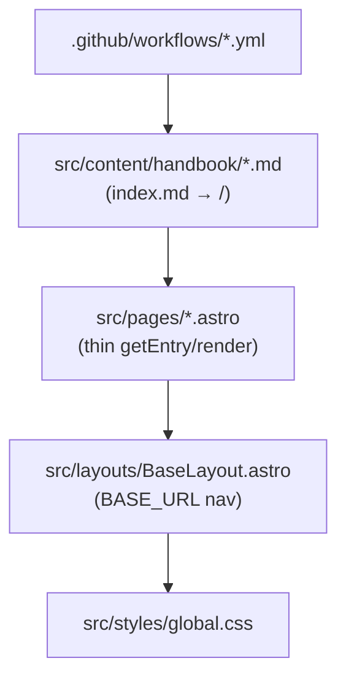

# Repo Discovery Guide (agent-only) — copilot-cli-handbook

This document is an internal discovery + maintenance index for coding agents. It is not user-facing documentation.

Use this file like a cache for Astro site structure, content conventions, and workflows.

- Prefer updating it when you discover drift (paths, npm scripts, CI behavior, content rules, base path).
- Treat the “Last verified” timestamp as the main trust signal; if you only reformat or reorganize text, do not update it.

## Table of Contents

- Maintenance snapshot
- High-signal docs (read-first index)
- Project structure map
- Runtime / dev entry points
- Content & workflow anchors
- CI reality (verified)
- When to update this file

## Maintenance snapshot

- Last verified: 2026-03-16
- Verification scope (high level): Astro pages/content collection, base-path handling, Playwright e2e config, npm scripts, content rules from business-requirements.instructions.md, CI workflows, and handbook routing after Release Tracker removal.

Keep this section short: the goal is to preserve the last verified date and why it can be trusted, not to fully inventory every subsystem.

## 1. High-signal docs (read-first index)

Mandatory startup reads (per copilot-instructions.md):

- README.md
- .github/copilot-instructions.md (startup rules, linting note, page pattern, base-path rule)
- .github/instructions/business-requirements.instructions.md
- .github/instructions/repository-memory.instructions.md

Additional high-signal files:

- astro.config.mjs (site + base path)
- src/content.config.ts (handbook collection schema)
- playwright.config.ts (e2e baseURL + webServer)
- src/pages/index.astro (thin MD renderer)
- src/layouts/BaseLayout.astro (BASE_URL nav + theme)
- .github/workflows/{deploy.yml,preview-deploy.yml,regression.yml}

## 2. Project structure map

Static Astro site (no backend/runtime services beyond dev server; Release Tracker removed):



Key navigation anchors:

- Content rules: `.github/instructions/business-requirements.instructions.md`
- Page pattern: `.github/copilot-instructions.md`
- Base path: `astro.config.mjs` + `import.meta.env.BASE_URL`
- Tests: `playwright-regression/site-regression.spec.ts` + `playwright.config.ts`
- Lint: `package.json` scripts + `.markdownlint.json` + `.husky/pre-commit`

No Python/Rust/DB/Neon/Bitcoin components. Pure static site + MD-driven content.

## 3. Runtime / dev entry points

Always start with:

```bash
npm install
```

- `npm run dev` — local dev server at `http://localhost:4321/copilot-cli-handbook`
- `npm run build` — production build to `dist/`
- `npm run preview` — preview built site
- `npm run lint` — prettier --check + markdownlint-cli2 on MD files
- `npm run test:e2e` — builds + starts preview server then runs Playwright (see playwright.config.ts for baseURL)
- `npm run test:e2e:ui` — interactive mode

**Playwright nuance**: webServer in playwright.config.ts runs `npm run build && npm run preview` with baseURL `http://localhost:4321/copilot-cli-handbook`. CI caches browsers via actions/cache.

No persistent services, PID files, or complex profiles. Pure static.

## 4. Content & workflow anchors

- **Content rules** (strict, from business-requirements.instructions.md): user-actionable only ("Can a user read this and go try it right now?"), omit internal, backend, or passive changes.
- Lock files: never edit `*.lock.yml` directly (sync from .md source).
- Contribution flow: README.md points contributors to issues and pull requests; run `npm run lint` locally before opening a PR.

## 5. CI reality (verified)

- Workflows use the Node version pinned in `.nvmrc` (currently Node 24 LTS).
- `regression.yml`: runs on PR/push to main; executes `npm run test:e2e`.
- `deploy.yml`: builds + deploys to GitHub Pages on main (sets ASTRO_BASE).
- `preview-deploy.yml`: PR previews + comments.
- No automatic lint in CI (run `npm run lint` locally before commit).
- Husky + lint-staged enforces formatting on commit for `*.md`, `*.astro`, etc.
- gh CLI available for creating PRs from workflows.

## When to update this file

Update on drift in file paths, npm scripts, content rules, base-path usage, test config, or workflow behavior. Re-verify against the current instruction files and actual CI files.
